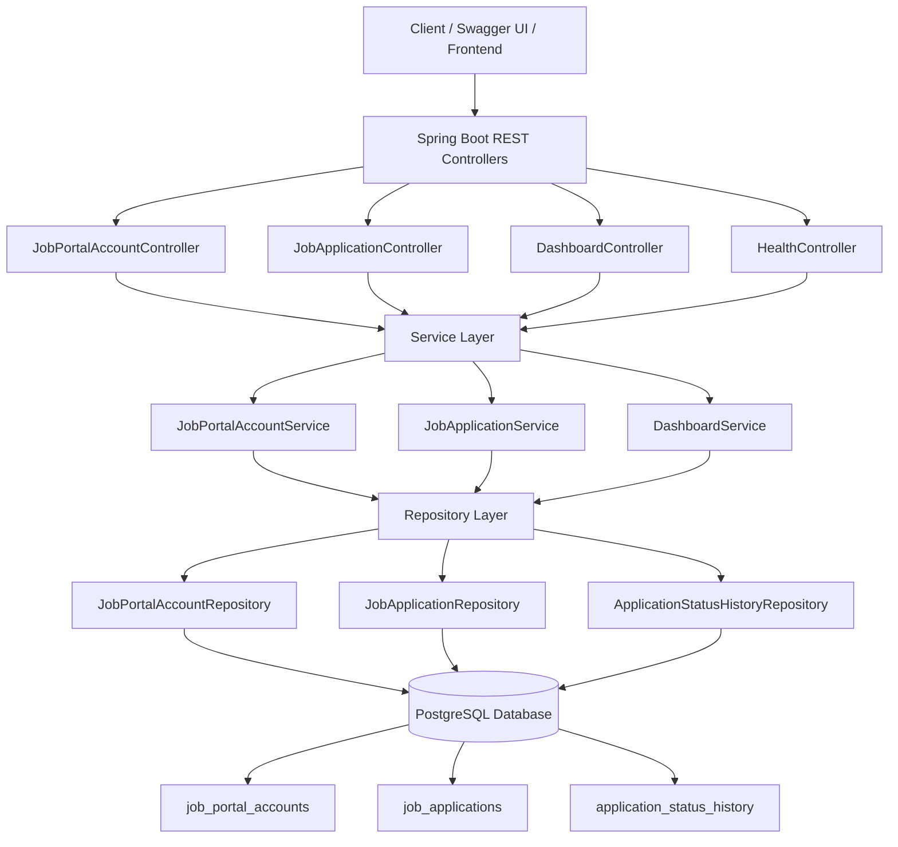
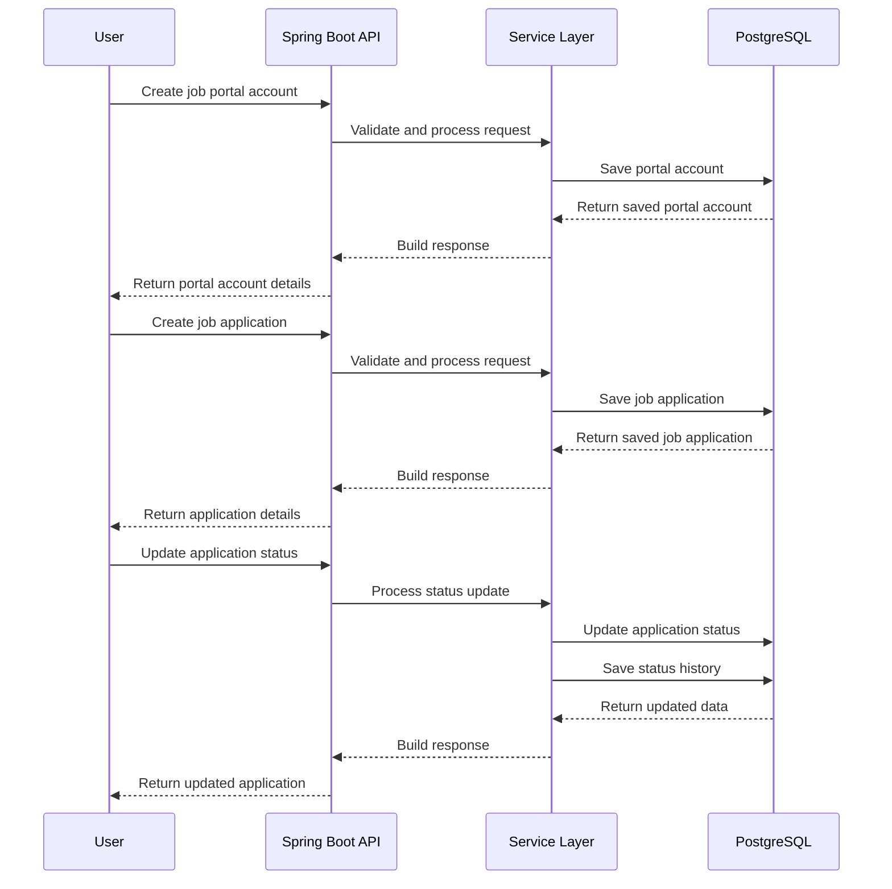

# JobTrackr API

JobTrackr is a Java Spring Boot backend application for managing job applications across multiple job portals in one centralized system. It is designed to help users organize applications submitted through platforms such as Workday, Greenhouse, Lever, iCIMS, Taleo, LinkedIn, Indeed, Dice, company career sites, and other external hiring portals.

The application provides a structured way to track portal accounts, job application details, application statuses, resume versions, and status history. It solves a common job-search problem where applications are spread across many company-specific portals, making it difficult to remember where a user applied, which login was used, what resume version was submitted, and what the latest application status is.

## Features

* Manage job portal accounts across companies and hiring platforms
* Track job applications with job title, job ID, job URL, applied date, and source
* Store resume version used for each application
* Track application status using defined stages
* Maintain status history for each application
* View dashboard summary of application activity
* Expose REST APIs for application management
* Use PostgreSQL for persistent data storage
* Provide Swagger/OpenAPI documentation for API testing

## Tech Stack

* Java 21
* Spring Boot
* Spring Web
* Spring Data JPA
* Hibernate
* PostgreSQL
* Docker
* Maven
* Lombok
* Swagger / OpenAPI

## Architecture Diagram



## System Flow



## Main Modules

### Job Portal Account

Stores company-specific job portal information such as company name, portal type, portal URL, login email, MFA indicator, password hint, and notes.

> This application does not store actual job portal passwords. It only stores password hints or references such as "Saved in Chrome" or "Saved in password manager."

### Job Application

Stores application-specific details such as job title, job ID, job URL, applied date, current status, resume version, source, and notes.

### Application Status History

Stores application status changes over time, allowing each application to maintain a clear timeline of progress.

### Dashboard

Provides summary-level application metrics, including total portal accounts, total applications, and application counts by status.

## API Endpoints

### Health Check

```http
GET /api/health
```

### Job Portal Accounts

```http
POST   /api/job-portal-accounts
GET    /api/job-portal-accounts
GET    /api/job-portal-accounts/{id}
PUT    /api/job-portal-accounts/{id}
DELETE /api/job-portal-accounts/{id}
```

### Job Applications

```http
POST   /api/applications
GET    /api/applications
GET    /api/applications/{id}
PUT    /api/applications/{id}
DELETE /api/applications/{id}
PATCH  /api/applications/{id}/status
```

### Dashboard

```http
GET /api/dashboard/summary
```

## Local Setup

### Start PostgreSQL

```bash
docker compose up -d
```

### Run the Application

```bash
./mvnw spring-boot:run
```

### Swagger UI

```text
http://localhost:8080/swagger-ui/index.html
```
